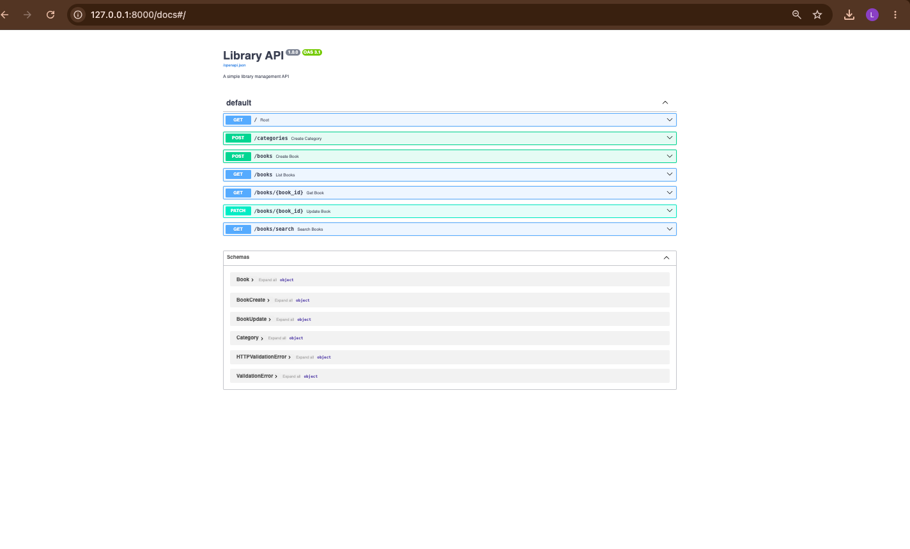
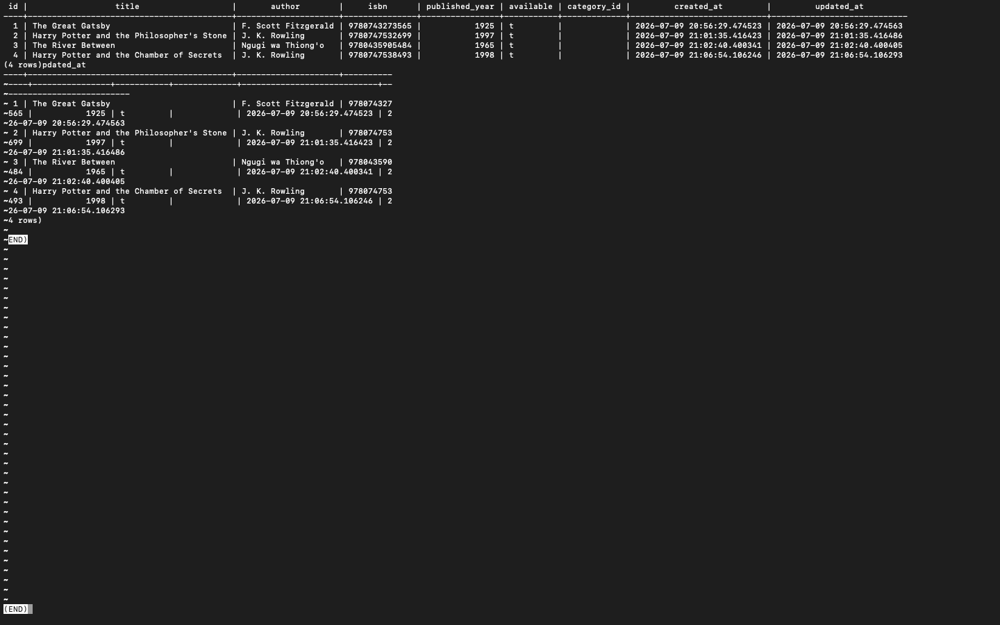

# Library API

A simple REST API built using FastAPI and SQLModel for managing books in a library database.

## Features

- Create a new book
- View all books
- View a single book by ID
- Search books by title or author
- Update book details
- Create book categories
- Filter available books

## Technologies Used

- Python
- FastAPI
- SQLModel
- PostgreSQL
- Uvicorn
- Docker

## Project Structure

```
library-api/
│
├── database/
│   ├── __init__.py
│   └── session.py
│
├── models/
│   ├── __init__.py
│   ├── book.py
│   └── category.py
│
├── main.py
├── docker-compose.yml
├── .env
├── pyproject.toml
└── README.md
```

## Running the Project

1. Install the required packages.
2. Start PostgreSQL using Docker Compose.
3. Run the application:

```bash
uv run uvicorn main:app --reload
```

4. Open the API documentation:

```
http://127.0.0.1:8000/docs
```
## Screenshots

### Swagger UI


### PostgreSQL Books Table


## Author

**Name:** Loise Maina

**Admission Number:** C027-01-0852/2024

